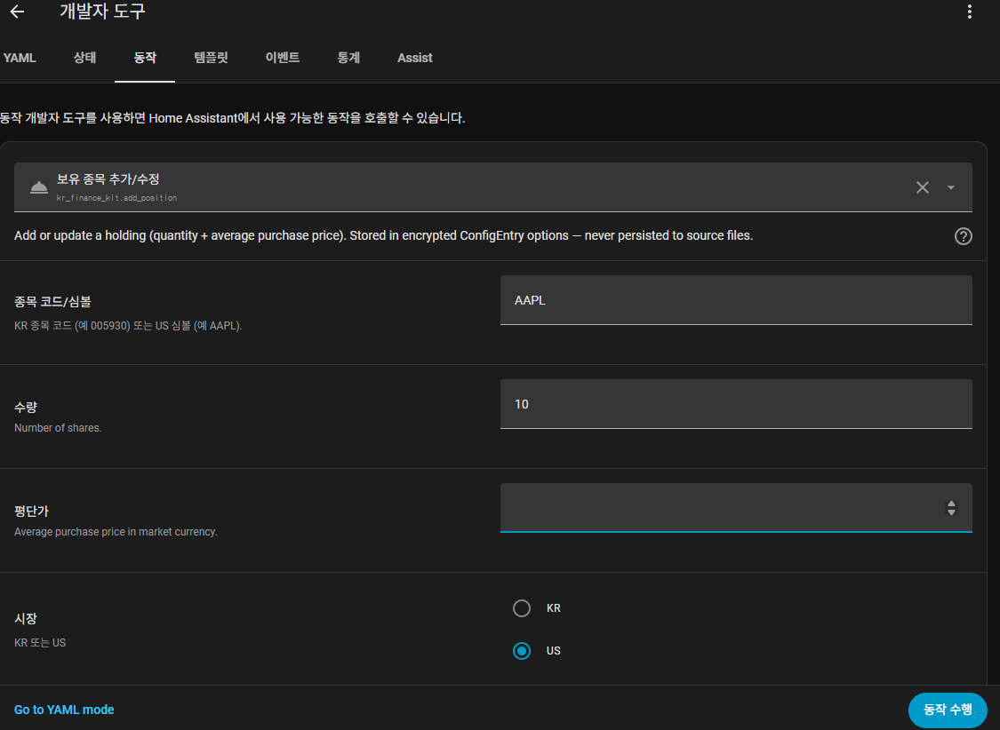

# KR Finance Kit

**[English](README.en.md)** · 한국어

> Home Assistant에서 한국·미국 주식, 환율, 암호화폐, OpenDart 공시까지 모두 네이티브 sensor로.
> 무료 API만 사용, 증권사 계정 연동 없음, 음성 비서 지원.

[](https://hacs.xyz)
[](https://www.home-assistant.io)
[](https://www.python.org)

[](https://github.com/redchupa/kr_finance_kit/actions/workflows/validate.yml)
[](https://github.com/redchupa/kr_finance_kit/actions/workflows/test.yml)
[](https://github.com/ranaroussi/yfinance)
[](https://opendart.fss.or.kr)
[](https://www.home-assistant.io)

[Releases](https://github.com/redchupa/kr_finance_kit/releases)

---

## 무엇을 할 수 있나요

- ☕ 거실 패널에서 코스피·내 종목·환율·비트코인 한눈에
- 📉 보유 종목이 평단가 대비 ±5% 움직이면 자동 알림
- ⏱️ "지난 30분 동안 ±2% 움직였다" 같은 단기 변동률 트리거
- 🗣️ "헤이 구글, 삼성전자 얼마야?" 음성 질의
- 🔔 OpenDart 신규 공시 푸시 (카테고리별 필터)
- 📊 장 마감 직후 일일 요약 자동 발송

모두 **무료 API** (yfinance + OpenDart 무료 키), 증권사 계정 X.

---

## 5분 설치

### 사전 준비
- Home Assistant + [HACS](https://hacs.xyz) 설치

### Step 1 · HACS 저장소 추가
1. HACS → ⋮ → **사용자 정의 저장소**
2. URL: `https://github.com/redchupa/kr_finance_kit` / Type: `Integration` → 추가

### Step 2 · 다운로드
1. HACS에서 **KR Finance Kit** 검색 → 다운로드
2. **HA 완전 재시작** (Reload 아닌 Restart)

### Step 3 · 통합 추가
**설정 → 기기 및 서비스 → + 통합 추가 → "KR Finance Kit"**

---

## 옵션 화면 한눈에 (v0.1.52 기준)

각 필드의 라벨 뒤 콜론(`:`)에 **그대로 복사·붙여넣기 가능한 예시**가 미리 보입니다.

| 옵션 | 설명 |
|---|---|
| OpenDart API 키 | (선택) 공시 알림 + 종목명 자동 매핑 활성. 비워두면 가격만. |
| 한국 종목 코드 | CSV. 6자리 = KOSPI, `.KQ` 접미사 = KOSDAQ |
| 미국 종목 심볼 | CSV. `AAPL:애플` 처럼 콜론 뒤 라벨 지정 가능 (없으면 yfinance longName 자동) |
| 암호화폐·환율·선물 | Yahoo ticker 형식 (`BTC-USD`, `EUR=X`, `GC=F` 등). 시장 시간 무관 24/7 갱신 |
| 코스피·코스닥 지수 포함 | 체크박스 (기본 ☑) |
| 나스닥·다우·S&P 500 지수 포함 | 체크박스 (기본 ☑) |
| 글로벌 지수 포함 | 닛케이·항생·FTSE·DAX (기본 ☐) |
| USD/KRW 환율 포함 | 체크박스 (기본 ☑) |
| 상세 attribute 포함 | 52주 고/저, 200일 평균, 배당, PE 등 (트래픽 ↑, 기본 ☐) |
| USD 자산을 KRW로 환산 | BTC·AAPL 같은 USD 가격에 `price_krw` attribute 추가 (기본 ☐) |
| 포트폴리오 평가손익 알림 임계값 % | 0=비활성. 5 입력 시 평단가 대비 ±5% 돌파하면 binary_sensor ON |
| 공시 카테고리 필터 | A=정기공시, B=주요사항 등 10종 다중선택. 비우면 전체 |

---

## 생성되는 sensor

### 시장 지표 (옵션으로 토글)
- `sensor.fi_kospi` / `sensor.fi_kosdaq` — 한국 지수
- `sensor.fi_nasdaq` / `_dow` / `_sp500` — 미국 지수
- `sensor.fi_nikkei` / `_hangseng` / `_ftse` / `_dax` — 글로벌 지수
- `sensor.fi_usdkrw` — USD/KRW 환율

### 종목 시세
- `sensor.fi_kr_<6자리>` — 한국 종목 (예 `_kr_005930`)
- `sensor.fi_us_<티커>` — 미국 종목 (예 `_us_aapl`)
- `sensor.fi_other_<슬러그>` — 암호화폐·환율·선물 (예 `_other_btc_usd`, 24/7 갱신)

### 종목 시세 attribute
- 기본: `price`, `change`, `change_pct` (전일 종가 대비), `prev_close`, `asof`, `stale`
- "상세 attribute 포함" ON 시: `fifty_two_week_high/low`, `fifty/two_hundred_day_average`, `regular_market_day_high/low/volume`, `market_state`, `currency`, `quote_type`, `long_name`, equity는 `dividend_*` / `forward_pe` / `trailing_pe`
- "USD→KRW 환산" ON 시 (USD 자산만): `price_krw`
- 단기 변동률 (옵션 없이 자동): `change_pct_1min` / `_5min` / `_15min` / `_30min` / `_60min` / `_90min` / `_120min` / `_180min` (8개 윈도우 고정)

### 포트폴리오 (서비스로 보유 종목 등록 시)
- `sensor.fi_portfolio_kr_value` / `_kr_pl` / `_us_value` / `_us_pl` / `_krw_total` / `_krw_pl`
- `binary_sensor.fi_portfolio_pl_alert` — 평단가 대비 ±임계값 돌파 시 ON

### 공시 (OpenDart 키 + 한국 종목 등록 시)
- `binary_sensor.fi_disclosure_<corp_code>` — 24시간 윈도우, device label은 종목명 (예 `삼성전자`)

### HA event bus (자동화 트리거용, 옵션 없음)
- `kr_finance_kit_kr_market_closed` — 한국 장 마감 시점 fire
- `kr_finance_kit_us_market_closed` — 미국 장 마감 시점 fire

---

## 보유 종목 등록 (서비스)

옵션 화면이 아닌 **HA 서비스(=동작)로 입력** — 평단가·수량은 HA 암호화 저장소에만 저장됩니다.

### 1. 추가하는 위치

**Settings → 개발자 도구(Developer Tools) → 동작(Actions) 탭** → 검색창에 `kr_finance_kit.add_position` 입력 → 폼이 자동으로 나타납니다.



> HA 2024.8+ 부터 기존 "서비스(Services)" 탭이 "동작(Actions)" 으로 명칭만 변경됐습니다. 같은 화면입니다.

### 2. 입력 필드

| HA UI 라벨 | 키 | 예시 | 비고 |
|---|---|---|---|
| 종목 코드/심볼 | `ticker` | `005930` / `AAPL` / `BTC-USD` | KR은 6자리 숫자, US는 심볼 |
| 수량 | `quantity` | `10` | 보유 주수 |
| 평단가 | `avg_price` | `60000` (KR=KRW) / `180.5` (US=USD) | 시장 통화 그대로 |
| 시장 | `market` | `KR` 또는 `US` | 라디오 버튼 |

저장 후 6개 portfolio sensor (`sensor.fi_portfolio_*`) + P/L alert binary_sensor가 자동으로 활성화됩니다.

### 3. 삭제

같은 화면에서 `kr_finance_kit.remove_position` 선택 → `ticker` + `market` 입력 → 동작 수행.

### 4. YAML로 일괄 등록 (선택)

여러 종목을 한 번에 넣고 싶다면 개발자 도구 → 동작 → "YAML 모드로 이동":

```yaml
action: kr_finance_kit.add_position
data:
  ticker: "005930"
  quantity: 10
  avg_price: 60000
  market: KR
```

종목별로 동작 1회씩 실행. 자동화 스크립트로 묶어두면 HA 시작 시 자동 등록도 가능.

---

## 자동화 블루프린트 3종

옵션 화면에서 종목을 여러 개 등록해두고, **블루프린트 입력에서 체크박스로 알림 받을 종목만 선택**하는 패턴. 종목 추가/삭제 시 자동화 재생성 불필요.

### 1. 종목 가격 변동률 알림 (전일 종가 기준)
[](https://my.home-assistant.io/redirect/blueprint_import/?blueprint_url=https%3A%2F%2Fgithub.com%2Fredchupa%2Fkr_finance_kit%2Fblob%2Fmain%2Fblueprints%2Fautomation%2Fkr_finance_kit%2Fprice_change_alert.yaml)

`change_pct` (전일 종가 대비) 기반. 입력: 종목·하락 임계값·상승 임계값·알림 대상.

### 2. 단기 변동률 알림 (사용자 지정 분 단위)
[](https://my.home-assistant.io/redirect/blueprint_import/?blueprint_url=https%3A%2F%2Fgithub.com%2Fredchupa%2Fkr_finance_kit%2Fblob%2Fmain%2Fblueprints%2Fautomation%2Fkr_finance_kit%2Fshort_window_alert.yaml)

**종목별로 다른 분을 트리거하려면 블루프린트 자동화를 여러 개 만드시면 됩니다.** 예:
- 자동화 1: 종목=[삼성전자], 윈도우=15분
- 자동화 2: 종목=[비트코인], 윈도우=60분

v0.1.53부터 sensor가 **1·5·15·30·60·90·120·180분** 8개 윈도우 attribute를 옵션 입력 없이 자동 생성. 블루프린트 number 입력에 그 중 하나(예 `30`) 넣으면 즉시 동작.

> 📥 **Import 직후 warm-up** — 첫 알림은 윈도우만큼 가격 샘플이 쌓여야 옴
> ⚠️ **HA 재시작 시** — N분 윈도우는 N분 동안 attribute None (memory-only buffer)

### 3. 일일 시장 요약
[](https://my.home-assistant.io/redirect/blueprint_import/?blueprint_url=https%3A%2F%2Fgithub.com%2Fredchupa%2Fkr_finance_kit%2Fblob%2Fmain%2Fblueprints%2Fautomation%2Fkr_finance_kit%2Fdaily_summary.yaml)

장 마감 직후(기본 15:30 KST) 지수·환율·종목·평가손익을 한 메시지로.

### 알림 호환성
모든 블루프린트는 `notify.send_message` (HA 2024.6+ 표준) 사용. mobile_app 자동 호환. service-only notify (일부 telegram_bot 모드 등) 사용자는 [docs/examples/](docs/examples/) 의 raw YAML 참고.

---

## 📊 끝내주는 대시보드

8섹션 통합 대시보드 — 포트폴리오 요약 · 지수/환율 · 한국·미국 보유 종목 · OpenDart 공시 · 7일 가격 추세 · 빠른 링크.

[](docs/examples/dashboard.yaml)

### 사용법

1. [docs/examples/dashboard.yaml](docs/examples/dashboard.yaml) 의 view 블록 복사
2. HA → Settings → Dashboards → ⋮ Edit → ⋮ **Raw configuration editor**
3. `views:` 아래에 paste → Save
4. 섹션 4 / 5 / 6 의 placeholder ticker (예 `sensor.fi_kr_005930`) 를 본인 종목 entity로 교체

> 모든 entity 참조는 `sensor.fi_*` / `binary_sensor.fi_*` 형식. v0.1.54+ 자동 migration 후 즉시 동작합니다.

### 구성 요소

| 섹션 | 카드 종류 | 포함 entity |
|---|---|---|
| 1. Hero | markdown | 포트폴리오 총평가금액·총평가손익 (템플릿) + 지수 요약 |
| 2. 포트폴리오 | tile × 7 | KRW 환산 합계 + 국가별 평가금액/평가손익 + P/L 알림 |
| 3. 지수 & 환율 | tile × 6 | KOSPI / KOSDAQ / USDKRW / NASDAQ / DOW / SP500 |
| 4. 🇰🇷 한국 보유 | tile × N | 본인 종목 placeholder |
| 5. 🇺🇸 미국 보유 | tile × N | 본인 종목 placeholder |
| 6. 신규 공시 | tile × N | OpenDart 공시 binary_sensor |
| 7. 가격 추세 | history-graph × 3 | 7일 / 168시간 |
| 8. 빠른 링크 | markdown | 보유 종목 추가·통합 옵션·자동화 페이지 |

---

## 자동화 직접 작성 (yaml)

### 평가손익 알림
```yaml
trigger:
  - platform: state
    entity_id: binary_sensor.fi_portfolio_pl_alert
    to: "on"
action:
  - service: notify.mobile_app_my_phone
    data:
      title: "포트폴리오 알림"
      message: >
        평가손익 {{ state_attr('binary_sensor.fi_portfolio_pl_alert', 'current_pl_pct') }}%
        — 임계값 ±{{ state_attr('binary_sensor.fi_portfolio_pl_alert', 'threshold_pct') }}%
```

### 한국 장 마감 직후 이벤트
```yaml
trigger:
  - platform: event
    event_type: kr_finance_kit_kr_market_closed
action:
  - service: notify.notify
    data:
      message: "코스피 종가 {{ states('sensor.fi_kospi') }}"
```

더 많은 예시: [docs/examples/](docs/examples/)

---

## 음성 비서

HA Assist에 자동 등록 (`finance_query` LLM tool). 8개 query_type:
- index / fx / quote / portfolio / disclosures / disclosure_for_ticker / top_movers / market_summary

예시 질문:
- "코스피 지금 얼마야?"
- "삼성전자 시세 알려줘"
- "오늘 가장 많이 오른 종목?"
- "오늘 시장 요약해줘"
- "관심 종목 새 공시 있어?"

Google Assistant / Alexa / ChatGPT 음성 모드 / 로컬 Whisper — HA Assist 통해 모두 사용 가능 (LLM 기반 conversation 통합 필요).

---

## FAQ

<details>
<summary><b>증권사 계정과 연동하나요?</b></summary>

**아니요.** 비공식 API 보안·법적 리스크가 있어 의도적으로 빼두었습니다. yfinance(Yahoo Finance 공개) + OpenDart(금융감독원 공식) + 사용자 직접 입력하는 평단가·수량 조합.
</details>

<details>
<summary><b>무료인가요?</b></summary>

전부 무료. yfinance·OpenDart 둘 다 무료 무제한(개인 사용 범위). 통합 자체도 MIT.
</details>

<details>
<summary><b>장 마감 후·주말에도 동작하나요?</b></summary>

직전 거래일 종가 표시. 한국·미국 공휴일 자동 처리. 암호화폐·환율은 24/7 갱신.
</details>

<details>
<summary><b>HA 재시작하면 단기 변동률이 None으로 보입니다</b></summary>

memory-only ring buffer라 정상. N분 윈도우면 N분 동안 None → 그 후 정상. 60분 윈도우는 약 1시간 warm-up.
</details>

<details>
<summary><b>옵션을 나중에 바꾸려면?</b></summary>

설정 → 기기 및 서비스 → KR Finance Kit → ⚙ 옵션. 저장하면 자동 reload.
</details>

<details>
<summary><b>차트 카드?</b></summary>

이 통합은 sensor만 제공. [apexcharts-card](https://github.com/RomRider/apexcharts-card)(별도 HACS) 또는 HA 기본 통계 카드에 연결해 사용.
</details>

---

<details>
<summary>⚙️ 기술 세부사항</summary>

### 데이터 소스
| 데이터 | 소스 | yfinance ticker |
|---|---|---|
| 코스피·코스닥 | yfinance | `^KS11`, `^KQ11` |
| 나스닥·다우·S&P 500 | yfinance | `^IXIC`, `^DJI`, `^GSPC` |
| 닛케이·항생·FTSE·DAX | yfinance | `^N225`, `^HSI`, `^FTSE`, `^GDAXI` |
| USD/KRW | yfinance | `KRW=X` |
| 한국 종목 | yfinance | `005930.KS` / `.KQ` |
| 미국 종목 | yfinance | `AAPL` |
| 암호화폐 | yfinance | `BTC-USD` (24/7) |
| 외환·선물 | yfinance | `EUR=X`, `GC=F` (24/7) |
| 공시 + 종목명 매핑 | OpenDart | `list.json`, `corpCode.xml` |

### 폴링 정책
- 한·미 시장 중 하나라도 열림: **60초**
- 양쪽 다 닫힘 (야간·주말): **600초** (자동 dial-down)
- 암호화폐·환율·선물: **항상 60초** (시장 시간 무관)

### Ring buffer (단기 변동률용)
- 메모리만, ticker당 deque(maxlen=300) ≈ 5시간 history
- HA 재시작 시 비워짐 (의도된 trade-off)

### 의존성
`yfinance>=0.2.40` 하나만. HA가 자동 설치.

### 제외 사항 (의도적)
- ❌ 자동 매매 (법·약관 리스크)
- ❌ 증권사 계좌 직연동
- ❌ 차트 카드 (apexcharts-card 사용)
- ❌ 백테스팅

</details>

---

## 🔄 기존 사용자 마이그레이션

| 버전 변화 | 영향 |
|---|---|
| ≤v0.1.31 → v0.1.32+ | entity_id 한국어 슬러그 (`sensor.hangug_*`) → 영어 슬러그. 통합 삭제 후 재추가 권장 |
| v0.1.32~v0.1.33 → v0.1.34+ | `sensor.kr_finance_kit_*` → `sensor.fi_*` 단축. 삭제+재추가 또는 entity_id 수동 변경 |
| ≤v0.1.43 → v0.1.44+ | 새 옵션 5종 (target_currency_krw, P/L alert, market_close events, global indices, disclosure filter) — 옵션 화면 한 번 저장 필요 |
| ≤v0.1.47 → v0.1.48+ | config_flow 500 에러 fix (frontend serialize 호환 selector 사용) |
| ≤v0.1.51 → v0.1.52 | 단기 변동률 옵션이 잠시 CSV로 도입 (지금은 제거됨). |
| ≤v0.1.52 → v0.1.53+ | 옵션 제거. sensor가 항상 1/5/15/30/60/90/120/180분 attribute 자동 생성. 블루프린트 number 입력에서 그 중 하나 선택. |

---

## 문제 해결

- 가격이 안 뜸 / Unavailable → HA 재시작 후 1~2분. 계속되면 [Issues](https://github.com/redchupa/kr_finance_kit/issues)
- 옵션 새 항목이 안 보임 → HA **완전 재시작** (Reload 아님, translation cache flush)
- `already_in_progress` 에러 → v0.1.47+ 받기, HA Restart
- `구성 흐름 500 에러` → v0.1.48+ 받기
- 더 자세한 가이드: [docs/installation-ko.md](docs/installation-ko.md)

---

## ☕ 후원

도움이 되셨다면 커피 한 잔 🙏

<table>
  <tr>
    <td align="center">
      <b>토스</b><br/>
      
    </td>
    <td align="center">
      <b>PayPal</b><br/>
      
    </td>
  </tr>
</table>

---

<sub>🤝 버그 리포트·기능 제안: [Issues](https://github.com/redchupa/kr_finance_kit/issues) | 📦 변경 이력: [Releases](https://github.com/redchupa/kr_finance_kit/releases) | 📝 [MIT License](LICENSE)</sub>

<details>
<summary>📘 English summary</summary>

A Home Assistant HACS integration exposing Korean and US equities, FX, crypto, and OpenDart disclosures as native HA sensors. Free data sources only (yfinance + OpenDart's free key), no brokerage credentials, voice-assist ready.

See [README.en.md](README.en.md) for the full English version.
</details>
